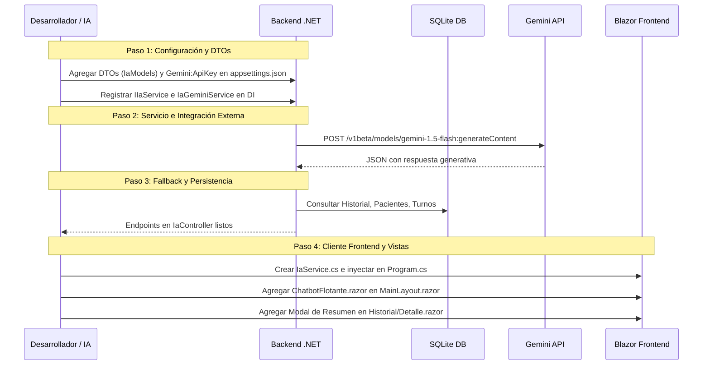

# Plan de Implementación: Integración de Copiloto de Turnos y Resumen Clínico con Google Gemini

Este documento constituye la especificación técnica y guía de implementación paso a paso para que cualquier desarrollador o agente de Inteligencia Artificial pueda comprender, reproducir e integrar el ecosistema de IA (Google Gemini) desarrollado para la plataforma veterinaria.

---

## 1. Visión General de la Solución

El sistema incorpora capacidades de Inteligencia Artificial Generativa y Conversacional a través de **Google Gemini** (`gemini-1.5-flash` / API v1beta) cubriendo dos áreas clave:

1. **Copiloto Flotante de Turnos (Chatbot Conversacional e Interactivo)**:
   - Asistente global accesible desde cualquier pantalla del sistema.
   - Procesamiento de solicitudes en lenguaje natural (ej: *"Anotar turno para Toby mañana a las 10:30 con Dra. Laura para vacuna"*).
   - Extracción de entidades (paciente, veterinario, fecha, hora, duración, motivo/servicio) y validación contra la base de datos (disponibilidad de agenda, solapamiento, pertenencia a sucursal).
   - Generación de **Tarjetas Interactivas de Turno Propuesto** dentro del chat con botón de confirmación en 1 clic.
   - Preguntas y respuestas generales sobre la clínica veterinaria asistidas por Gemini.
2. **Resumen Clínico Inteligente de Historia Clínica**:
   - Análisis sintético y estructurado del expediente médico completo de una mascota (datos biométricos, últimas 10 consultas médicas, tratamientos activos/finalizados y plan de vacunación).
   - Generación de informe en formato JSON estructurado y Markdown ejecutivo para el veterinario.
   - **Mecanismo de Resiliencia / Fallback Local**: Si la API Key de Gemini no está configurada o falla la conexión externa, se activa automáticamente un motor clínico estructurado local que genera el resumen sin interrumpir la experiencia de usuario.

```
┌─────────────────────────────────────────────────────────────┐
│                    BLAZOR FRONTEND                          │
│  ┌───────────────────────┐       ┌───────────────────────┐  │
│  │ ChatbotFlotante.razor │       │ Resumen Modal en      │  │
│  │ (Copiloto Global)     │       │ Historial/Detalle     │  │
│  └───────────┬───────────┘       └───────────┬───────────┘  │
│              └───────────────┬───────────────┘              │
│                              ▼                              │
│                    IaService (HTTP Client)                  │
└──────────────────────────────┬──────────────────────────────┘
                               │ JSON / HTTP REST
                               ▼
┌─────────────────────────────────────────────────────────────┐
│                   ASP.NET CORE WEB API                      │
│                  IaController [Authorize]                   │
│                              │                              │
│                              ▼                              │
│                      IIaService                             │
│                              │                              │
│                              ▼                              │
│                      IaGeminiService                        │
│         ┌────────────────────┴────────────────────┐         │
│         ▼                                         ▼         │
│   Google Gemini API                         Motor Local     │
│   (generativelanguage.googleapis.com)       (Fallback)      │
│         │                                         │         │
│         └────────────────────┬────────────────────┘         │
│                              ▼                              │
│              Repositories & SQLite Database                 │
│         (Turnos, Pacientes, Veterinarios, Historiales)       │
└─────────────────────────────────────────────────────────────┘
```

---

## 2. Modelos de Datos y DTOs (Contratos)

Ambos proyectos (Backend en `Application/DataTransferObjects` y Frontend en `Models/IaModels.cs`) comparten la misma estructura de contratos.

### 2.1. DTO de Estado (`IaStatusDto`)
```csharp
public class IaStatusDto
{
    public bool Configurado { get; set; }
    public string Proveedor { get; set; } = "Google Gemini";
    public string Modelo { get; set; } = "gemini-1.5-flash";
    public string Mensaje { get; set; } = string.Empty;
}
```

### 2.2. DTOs de Conversación (`ChatbotRequestDto`, `ChatbotResponseDto`, `ChatMensajeDto`)
```csharp
public class ChatMensajeDto
{
    public string Role { get; set; } = "user"; // "user" o "model"
    public string Content { get; set; } = string.Empty;
    public DateTime Timestamp { get; set; } = DateTime.Now;
    public TurnoPropuestoDto? TurnoPropuesto { get; set; }
}

public class ChatbotRequestDto
{
    public string Mensaje { get; set; } = string.Empty;
    public List<ChatMensajeDto> Historial { get; set; } = new();
    public int? SucursalId { get; set; }
}

public class TurnoPropuestoDto
{
    public string? TurnoId { get; set; }
    public string PacienteId { get; set; } = string.Empty;
    public string PacienteNombre { get; set; } = string.Empty;
    public string VeterinarioId { get; set; } = string.Empty;
    public string VeterinarioNombre { get; set; } = string.Empty;
    public int? ServicioId { get; set; }
    public string ServicioNombre { get; set; } = string.Empty;
    public int? SucursalId { get; set; }
    public DateTime FechaHora { get; set; }
    public int DuracionMinutos { get; set; } = 30;
    public string Motivo { get; set; } = string.Empty;
    public string Observaciones { get; set; } = string.Empty;
    public bool ListoParaConfirmar { get; set; }
    public string? MensajeValidacion { get; set; }
}

public class ChatbotResponseDto
{
    public bool Exito { get; set; } = true;
    public string Respuesta { get; set; } = string.Empty;
    public string TipoRespuesta { get; set; } = "texto"; // "texto", "propuesta_turno", "turno_confirmado", "guia_agendamiento"
    public TurnoPropuestoDto? TurnoPropuesto { get; set; }
    public List<string> OpcionesSugeridas { get; set; } = new();
    public string? ErrorMensaje { get; set; }
}
```

### 2.3. DTO de Resumen Clínico (`ResumenHistoriaClinicaDto`)
```csharp
public class ResumenHistoriaClinicaDto
{
    public string PacienteId { get; set; } = string.Empty;
    public string PacienteNombre { get; set; } = string.Empty;
    public string InformacionBasica { get; set; } = string.Empty;
    public string UltimaConsulta { get; set; } = string.Empty;
    public string TratamientosYVacunas { get; set; } = string.Empty;
    public string AlertasYRecomendaciones { get; set; } = string.Empty;
    public string ResumenCompletoMarkdown { get; set; } = string.Empty;
    public DateTime FechaGeneracion { get; set; } = DateTime.Now;
    public bool GeneradoPorIa { get; set; } = true;
    public string ModeloUtilizado { get; set; } = "gemini-1.5-flash";
}
```

---

## 3. Backend: Arquitectura e Implementación

### 3.1. Configuración (`appsettings.json`)
```json
{
  "Gemini": {
    "ApiKey": "AIzaSy...",
    "Model": "gemini-1.5-flash"
  }
}
```
> [!NOTE]
> La aplicación también comprueba automáticamente la variable de entorno `GEMINI_API_KEY` si `Gemini:ApiKey` no está presente en el archivo de configuración.

### 3.2. Contrato de Servicio (`IIaService`)
Ubicación: `Backend/Application/Repositories/IIaService.cs`
```csharp
public interface IIaService
{
    Task<IaStatusDto> GetStatusAsync();
    Task<IaStatusDto> IsConfiguredAsync();
    Task<ChatbotResponseDto> ProcesarMensajeChatAsync(ChatbotRequestDto request, string usuarioNombre, string usuarioRol, int? sucursalId);
    Task<ChatbotResponseDto> ConfirmarTurnoPropuestoAsync(TurnoPropuestoDto turnoDto, string usuarioRol, int? sucursalId);
    Task<ResumenHistoriaClinicaDto> GenerarResumenHistorialAsync(string pacienteId);
}
```

### 3.3. Invocación HTTP Nativa a Gemini API
En `Backend/Infrastructure/Services/IaGeminiService.cs`:
- **Endpoint**: `https://generativelanguage.googleapis.com/v1beta/models/{model}:generateContent?key={apiKey}`
- **Método**: `POST`
- **Estructura del Request**:
  ```json
  {
    "contents": [
      {
        "role": "user",
        "parts": [{ "text": "Prompt aquí..." }]
      }
    ],
    "generationConfig": {
      "temperature": 0.2,
      "responseMimeType": "application/json" // o "text/plain"
    }
  }
  ```
- **Extracción de Respuesta**:
  ```csharp
  var geminiDoc = JsonDocument.Parse(responseJson);
  var text = geminiDoc.RootElement
      .GetProperty("candidates")[0]
      .GetProperty("content")
      .GetProperty("parts")[0]
      .GetProperty("text")
      .GetString();
  ```
- **Limpieza de Markdown (`CleanJsonMarkdown`)**:
  Elimina ` ```json ` y ` ``` ` que Gemini puede envolver en la respuesta antes de pasarla al deserializador `System.Text.Json`.

### 3.4. Motor de Resumen Clínico
1. Recopila mediante repositorios:
   - Entidad `Paciente` (Especie, Raza, Sexo, Edad, Observaciones).
   - Últimos 10 registros de `HistorialClinico` (Fecha, Veterinario, Motivo, Síntomas, Diagnóstico, Indicaciones, Peso, Temperatura).
   - Últimos 6 `Tratamientos` (Diagnóstico, Medicación, Estado Finalizado/Activo).
   - Últimas 6 `Vacunas` (Nombre vacuna, Fecha aplicación, Próxima dosis).
2. Construye el prompt clínico exigiendo JSON con las claves exactas:
   - `informacionBasica`
   - `ultimaConsulta`
   - `tratamientosYVacunas`
   - `alertasYRecomendaciones`
   - `resumenCompletoMarkdown`
3. Si Gemini falla o no hay API Key, ejecuta `GenerarResumenEstructuradoLocal` que sintetiza las mismas variables mediante plantillas determinísticas para garantizar que la vista nunca devuelva un error 500.

### 3.5. Copiloto de Turnos (Chatbot)
El flujo en `ProcesarMensajeChatAsync` sigue estas prioridades:
1. **Detección de Ayuda/Guía**: Si el mensaje solicita agendamiento genérico, responde con la guía de formato y ejemplos.
2. **Consulta de Turnos del Día**: Si el mensaje contiene "turnos de hoy" o "agenda hoy", consulta `TurnoRepository` filtrando por la fecha actual y la sucursal del usuario, devolviendo el listado formateado.
3. **Extracción Heurística de Entidades de Turno (`IntentarExtraerTurnoAsync`)**:
   - **Paciente**: Busca coincidencias por nombre o ID en `_pacienteRepository`.
   - **Veterinario**: Busca coincidencias por nombre o apellido en `_veterinarioRepository`.
   - **Fecha y Hora**: Interpreta términos relativos como "hoy", "mañana", días de la semana ("lunes", "martes"...), y formatos de hora "HH:mm" o "HH hs".
   - **Servicio/Motivo**: Detecta palabras clave ("vacunación", "consulta", "control", "desparasitación", "cirugía").
   - **Validación de Disponibilidad**: Verifica que el veterinario no tenga turnos solapados en el rango de duración (`DuracionMinutos`).
   - Si todos los campos requeridos están presentes, genera un `TurnoPropuestoDto` con `ListoParaConfirmar = true`.
4. **Respuesta Conversacional Abierta**: Si no se trata de agendamiento y hay API Key, delega a `ConsultarGeminiConversacionalAsync` con el historial reciente (hasta 6 mensajes).
5. **Confirmación de Turno (`ConfirmarTurnoPropuestoAsync`)**:
   - Valida la existencia de las entidades foráneas.
   - Crea y persiste la entidad de dominio `Domain.Entities.Turno`.
   - Devuelve `ChatbotResponseDto` con `TipoRespuesta = "turno_confirmado"` y mensaje de éxito.

### 3.6. Controlador REST (`IaController.cs`)
Ubicación: `Backend/Template-API/Controllers/IaController.cs`
- `GET api/v1/Ia/status` -> Consulta estado de Gemini (público / anónimo).
- `POST api/v1/Ia/chat` -> Requiere autenticación JWT. Pasa nombre, rol y sucursal del usuario.
- `POST api/v1/Ia/confirmar-turno` -> Persiste el turno propuesto.
- `GET api/v1/Ia/resumen-historial/{pacienteId}` -> Requiere rol `Admin`, `Veterinario` o `Gerente`.

---

## 4. Frontend (Blazor): Componentes e Integración

### 4.1. Servicio Cliente (`IaService.cs`)
Ubicación: `Frontend/BlazorFrontEnd/Services/IaService.cs`
- Registrado en DI como Scoped en `Program.cs`: `builder.Services.AddScoped<IaService>();`.
- Métodos tipados: `GetStatusAsync()`, `EnviarMensajeChatAsync()`, `ConfirmarTurnoAsync()`, `GenerarResumenHistorialAsync()`.

### 4.2. Componente Copiloto Global (`ChatbotFlotante.razor`)
Ubicación: `Frontend/BlazorFrontEnd/Components/Shared/ChatbotFlotante.razor`
- **Ubicación Global**: Se monta en `MainLayout.razor` dentro del contenedor principal para estar presente en todas las rutas.
- **Botón Flotante (`chatbot-bubble-btn`)**:
  - Posición fija (`bottom: 24px; right: 24px; z-index: 1050`).
  - Animación suave de entrada y efecto pulso (`has-pulse`).
  - Icono SVG de chispas/sparkles estilizado con el badge *"Gemini IA"*.
- **Ventana de Chat (`chatbot-window`)**:
  - Panel flotante con sombra (`box-shadow: 0 10px 30px rgba(0,0,0,0.5)`), borde sutil y fondo oscuro/translúcido (`background: #111827; border: 1px solid rgba(255,255,255,0.15)`).
  - Header con indicador de conexión verde en vivo y botón de reseteo rápido.
  - Auto-scroll al recibir mensajes mediante `JS.InvokeVoidAsync("scrollToBottom")`.
  - Soporte de renderizado Markdown simple para respuestas del bot (negritas, viñetas, saltos de línea).
  - **Tarjeta de Propuesta de Turno**:
    ```razor
    @if (msg.TurnoPropuesto != null)
    {
        <div class="turno-card">
            <div class="turno-card-header">
                <span class="badge-tag">📅 Turno Propuesto</span>
                <span class="time-badge">@msg.TurnoPropuesto.FechaHora.ToString("dd/MM/yyyy HH:mm") hs</span>
            </div>
            ...
            <button class="btn-confirm-turno" @onclick="() => ConfirmarTurno(msg.TurnoPropuesto)">
                ✅ Confirmar Turno
            </button>
        </div>
    }
    ```
  - **Chips / Opciones Sugeridas**: Botones de respuesta rápida bajo el input de texto.

### 4.3. Resumen Clínico en Historia Clínica (`Detalle.razor`)
Ubicación: `Frontend/BlazorFrontEnd/Components/Pages/Historial/Detalle.razor`
- **Botón de Acción**:
  - Botón con gradiente tecnológico (`linear-gradient(135deg, #0284c7 0%, #2563eb 50%, #7c3aed 100%)`).
  - Texto: *"Resumen IA (Gemini)"*.
- **Modal de Resumen Clínico**:
  - Overlay modal (`modal-overlay modal-overlay-z2`).
  - Panel modal (`modal-panel`) con ancho amplio para lectura cómoda.
  - Estado de carga: Spinner animado con mensaje *"Analizando historia clínica con Gemini..."*.
  - Grilla de tarjetas estructuradas:
    1. **Información Básica del Paciente**: Resumen biológico y antecedentes.
    2. **Última Consulta Médica**: Motivo, diagnóstico e indicaciones recientes.
    3. **Tratamientos y Vacunas**: Medicamentos actuales y estado de vacunación.
    4. **Alertas y Recomendaciones**: Signos de alarma y controles sugeridos.
  - Pestaña / Bloque de **Informe Completo en Markdown** para visualización continua o copiado rápido.
  - Pie del modal: Badge de trazabilidad con el modelo (`resumenIa.ModeloUtilizado`) y fecha/hora exacta de generación.

---

## 5. Guía de Replicación para otra IA / Desarrollador

Para replicar esta funcionalidad en un nuevo proyecto o rama, seguir esta secuencia ordenada:



### Checklist de Implementación
- [ ] **1. Dependencias**: No se requieren paquetes NuGet de terceros; utiliza únicamente `HttpClient`, `System.Text.Json` y `Microsoft.Extensions.Configuration`.
- [ ] **2. Credenciales**: Crear clave en [Google AI Studio](https://aistudio.google.com/) y asignarla a `Gemini:ApiKey` o a la variable de entorno `GEMINI_API_KEY`.
- [ ] **3. Inyección de Dependencias**:
  - En `Backend/Infrastructure/Registrations/`:
    ```csharp
    services.AddHttpClient("GeminiClient", client => { client.Timeout = TimeSpan.FromSeconds(30); });
    services.AddScoped<IIaService, IaGeminiService>();
    ```
  - En `Frontend/BlazorFrontEnd/Program.cs`:
    ```csharp
    builder.Services.AddScoped<IaService>();
    ```
- [ ] **4. Permisos y Roles**: Los endpoints del chatbot admiten cualquier rol autenticado (`Admin`, `Veterinario`, `Recepcionista`, `Gerente`), mientras que el resumen clínico está restringido a perfiles con facultades médicas y de gestión (`Admin`, `Veterinario`, `Gerente`).

---

## 6. Plan de Verificación y Pruebas

### Pruebas Automatizadas y de Compilación
```powershell
# Compilación de la solución Backend
dotnet build Backend/HybridDDDArchitecture.sln

# Compilación de la solución Frontend
dotnet build Frontend/BlazorFrontEnd/BlazorFrontEnd.csproj
```

### Pruebas Manuales de Integración
1. **Prueba de Estado de IA**:
   - Navegar o invocar `GET /api/v1/Ia/status`.
   - Debe retornar `Configurado: true` si hay API Key, o `Configurado: false` con mensaje informativo si opera en modo local.
2. **Prueba del Chatbot Copiloto**:
   - Abrir el sistema y presionar la burbuja flotante en la esquina inferior derecha.
   - Escribir: *"¿Qué turnos hay hoy?"* -> Verificar que devuelva la agenda del día o indique que no hay turnos.
   - Escribir: *"Turno para [NombreMascota] con [NombreVeterinario] mañana 10:30 para control"* -> Verificar que aparezca la tarjeta interactiva con botón *"Confirmar Turno"*.
   - Hacer clic en *"Confirmar Turno"* -> Verificar que se persista en la base de datos y aparezca en la Agenda.
3. **Prueba de Resumen Clínico**:
   - Ir a **Historial Clínico** -> Seleccionar un paciente con consultas.
   - Presionar el botón *"Resumen IA (Gemini)"*.
   - Comprobar que el modal se abre con fondo y tarjetas visibles, mostrando la información básica, última consulta, tratamientos, alertas y markdown.
